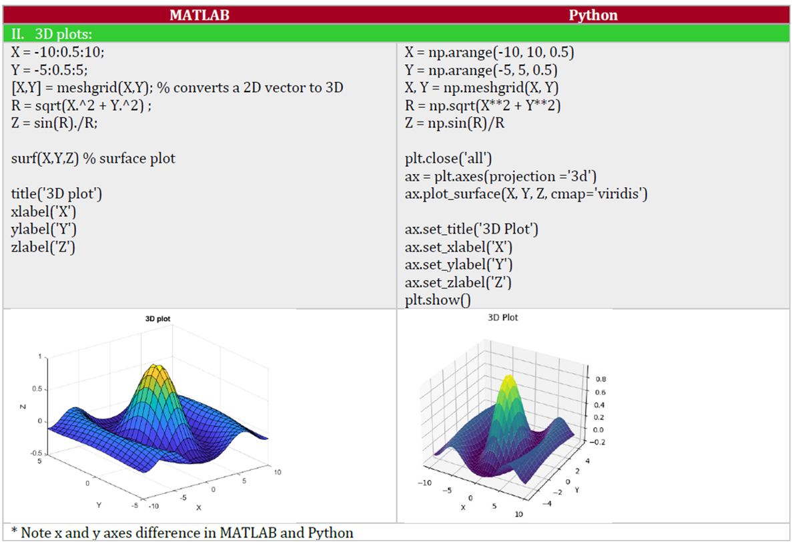

<h1 align="center">Simple Python and MATLAB for Control Systems Simulation and Data Visualisation: A Side-by-Side Tutorial</h1>


<p align="center">
  
</p>
This repository provides a simplified approach to learning Python for control system simulation and data visualisation for engineers and researchers coming from a MATLAB background. It uses a novel **side-by-side approach** to achieve a similar level of proficiency in both programming languages for basic tasks. Two main guides are provided:

**A – Installation Guide**  
First, a short note on installing Python and VS Code for development. Any similar IDE, such as Google Colab, can be used instead.  
[Download the Installation Guide here](Python_Visual_Studio_Code_Control_Installation_V1.pdf)
* If you already have a Python interpreter installed, you can proceed to the next step. 

**B – Side-by-Side Technical Note**  
The main PDF file includes the side-by-side tutorial with detailed explanations.  
[Download the Python MATLAB Tutorial here](Python%20MATLAB%20Tuturial.pdf)


The PDF includes examples covering various control topics in the following chapters:

1. **Introduction**  
2. **Basic vector and matrix manipulations**  
3. **Basic plotting functions and visualisation**  
4. **Classic linear control system analysis (transfer function)**  
5. **State-space control system design and analysis**  
6. **Control flow statements (loops and conditional statements)**  
7. **Defining functions**  
8. **Differential equation (nonlinear system) simulation**  
9. **Discrete-time control system analysis**  
10. **Data analysis and visualisation**

Together, these Chapters provide the essential knowledge to carry out basic tasks with equivalent proficiency in both programming languages. It assumes that the reader is already familiar with the underlying theory and MATLAB simulations for each topic.


<p align="center">
  
</p>  
<p align="center">
  
</p>  
<p align="center">
  
</p>

> You can utilise the file with a citation.

> Author: [Pouria Sarhadi](https://go.herts.ac.uk/pouria-sarhadi).

**Reference:**
<p>[1] P. Sarhadi, <em>Python and MATLAB for Control Systems Simulation: A Side-by-Side Tutorial, Zenodo, 2026. DOI: <a href="https://doi.org/10.5281/zenodo.10.5281/zenodo.18557127">10.5281/zenodo.18557127</a>. [Online]. Available: <a href="https://zenodo.org/records/18557128">https://zenodo.org/records/18557128</a></p>


<!-- BibTeX citation -->
```bibtex
@misc{Sarhadi2026pythonmatlab,
  author       = {Pouria Sarhadi},
  title        = {Python and MATLAB for Control Systems Simulation: A Side-by-Side Tutorial},
  year         = {2026},
  publisher    = {Zenodo},
  doi          = {10.5281/zenodo.18557127},
  url          = {https://zenodo.org/records/18557128}
}
```
